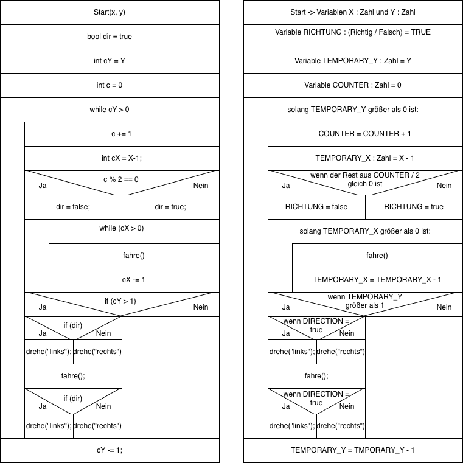

## Greenfoot Rover Szenario
### Allgemeine Informationen

Ein Projekt aus dem Informatik Unterricht aus der Schule.

Greenfoot Software: [Greenfoot Software Homepage](https://www.greenfoot.org/door)

### Ein paar Funktionen von mir:

- "toPoint(x, y)" (und alle dazugehörigen)
- "square(x, y)"

#### Square

(Naja, Schule halt haha)

